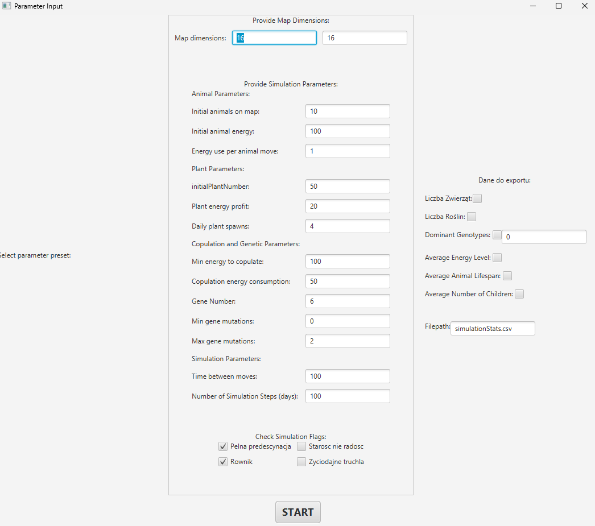
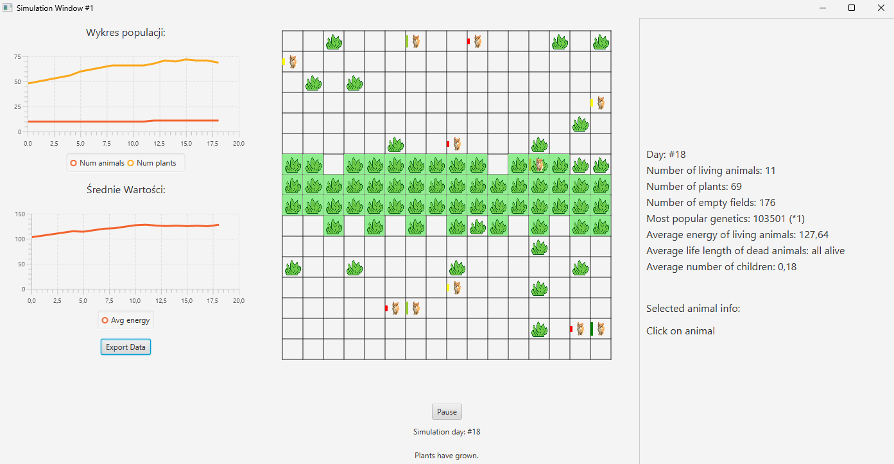
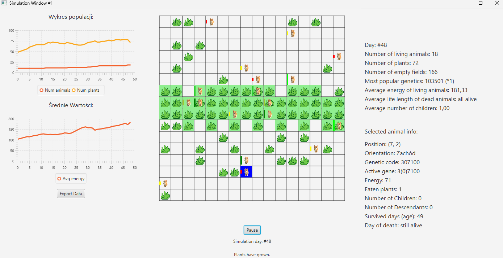
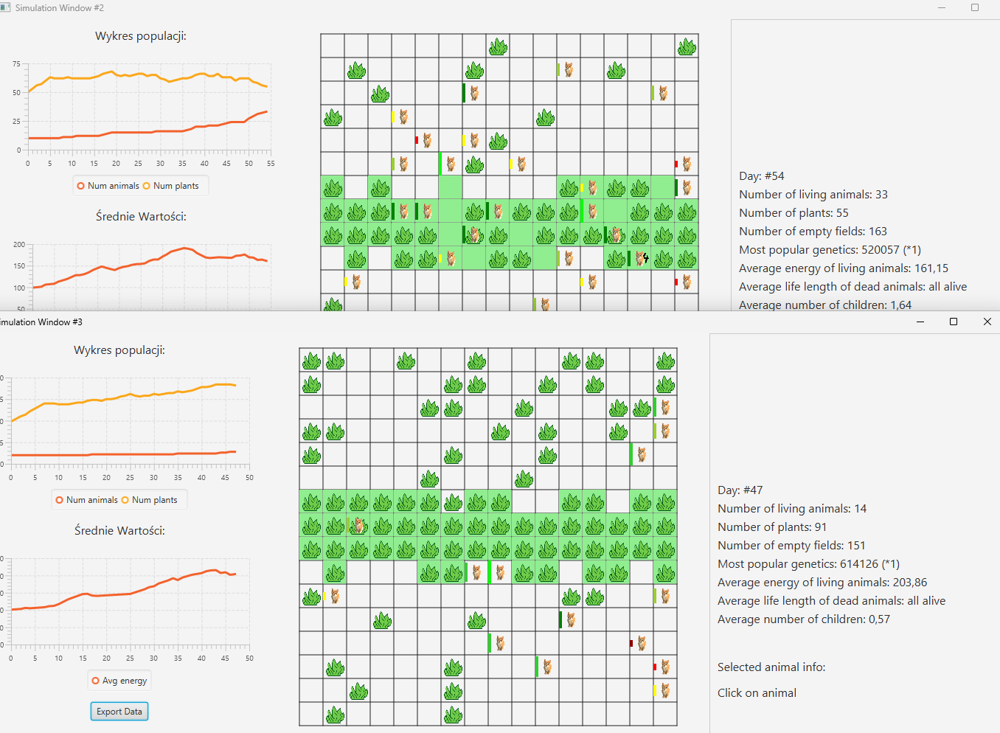

Symulacja Ewolucyji
---

Repozytorium zawiera projekt symulującego ewolucyjnego świata, w którym zwierzęta (roślinożerne) szukają jedzenia (roślin) i ewoluują w czasie. Gra rozgrywa się na siatce, a mechanika obejmuje poziom energii, ruch i rozwój gatunków za pomocą algorytmów genetycznych. Inspiracją były m.in. "Land of Lisp". Projekt pozwala na adaptację zwierząt do zmieniającego się środowiska. Stworzony w Javie z użyciem Gradle i JavaFX. Więcej informacji znajdziesz na stronie [opisu wymagań]([https://github.com/tomaszmol](https://github.com/Soamid/obiektowe-lab/tree/master/proj))

---

### Współautorzy:
- Tomasz Mol - [tomaszmol](https://github.com/tomaszmol)
- Dominik Matuszczyk - [DominikMat](https://github.com/DominikMat)

---

### Jak uruchomić projekt?

### 1. Zainstaluj Java 21
Upewnij się, że masz zainstalowaną wersję Java 21.

### 2. Sklonuj repozytorium
```bash
git clone https://github.com/tomaszmol/projekt_PO.git
cd projekt_PO
```

### 3. Zbuduj projekt
Upewnij się, że masz zainstalowany Gradle. Następnie uruchom:
```bash
gradle build
```

### 4. Uruchom projekt
```bash
gradle run
```

Sprawdź plik `build.gradle` w celu uzyskania dodatkowych konfiguracji lub zależności.

---

## Zrzuty ekranu z działania programu:

### 1. Wprowadzenie parametrów


### 2. Symulacja


### 3. Możliwość zaznaczenia zwierzaka i dostania o nim informacji


### 4. Możliwość uruchomienia wielu symulacji jednocześnie



